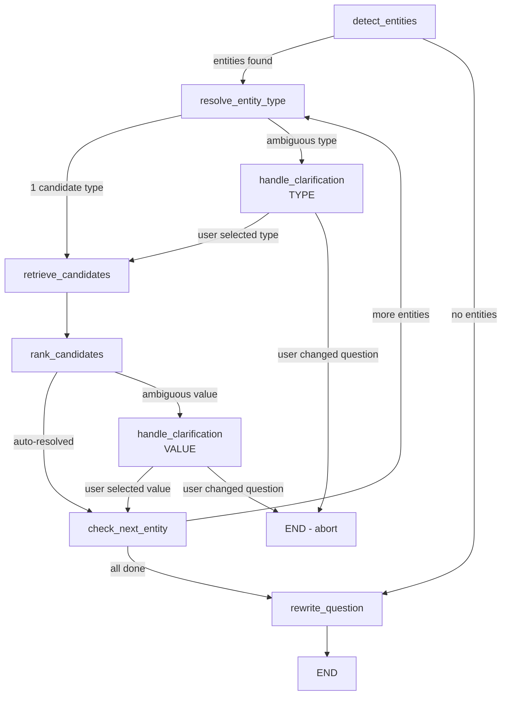
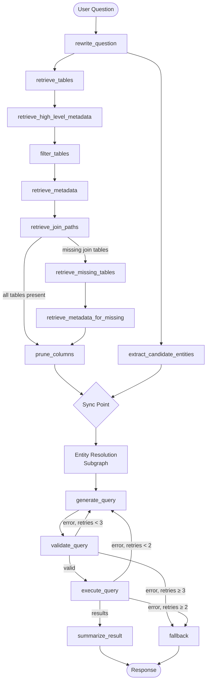

# Text-to-SQL Agentic Workflow Design

> A generalized, research-oriented description of the multi-stage LangGraph pipeline for translating natural language questions into executable SQL over arbitrary relational databases.

---

## 1. System Overview

The system implements a **stateful, multi-stage agentic workflow** using LangGraph (a graph-based orchestration framework built on LangChain). A user's natural language question passes through a sequence of retrieval, reasoning, and generation stages before producing an executable SQL query, its results, and a natural language summary.

### 1.1 Core Design Principles

| Principle | Description |
|---|---|
| **Schema-Agnostic** | The workflow operates over a pre-ingested **Knowledge Base (KB)** of table/column metadata, domain rules, entity aliases, and join relationships. It does not hardcode any schema. |
| **RAG-Driven Context Assembly** | Every LLM call receives only the context retrieved for the current question — not the full database schema. This keeps prompts compact and reduces hallucination. |
| **Multi-Turn Conversational Memory** | The system maintains conversation context (prior Q&A summaries + last successful SQL) to resolve follow-up references like "break that down by region." |
| **Human-in-the-Loop Clarification** | When entity mentions are ambiguous (type or value), the workflow **pauses execution** (LangGraph `interrupt`) and asks the user to disambiguate before continuing. |
| **Self-Correcting SQL Generation** | Failed SQL queries (validation or execution errors) are fed back to the generator with full error context for automatic retry (up to 3 attempts). |
| **Parallel Execution** | Independent retrieval tasks (table search, entity candidate extraction) are executed concurrently to minimize latency. |

### 1.2 Technology Stack

| Component | Technology |
|---|---|
| Orchestration | LangGraph `StateGraph` with `MemorySaver` checkpointer |
| LLMs | OpenAI GPT family (multiple tiers for cost/accuracy tradeoff) |
| Embeddings | OpenAI `text-embedding-3-small` |
| Table Vector Store | PGVector (PostgreSQL + pgvector extension) |
| Entity Vector Store | PGVector (separate collection) |
| Schema Graph | Neo4j (table nodes + FK edges for join path discovery) |
| Metadata Store | PostgreSQL (async via SQLAlchemy + asyncpg) |
| Target Database | MySQL (the database being queried) |
| API Layer | FastAPI (stateless REST, session managed via LangGraph checkpointer) |

---

## 2. Knowledge Base (Offline Pre-Processing)

Before the runtime workflow executes, the system requires a **Knowledge Base** built from the target database. This is a one-time (or periodic) offline step.

### 2.1 Schema Metadata Store

Each table and column in the target database is registered in a PostgreSQL metadata store with:

- **TableMeta**: `table_name`, `user_description`, `generated_explanation` (LLM-generated), `processing_status`
- **ColumnMeta**: `column_name`, `data_type`, `is_primary_key`, `is_foreign_key`, `fk_target_table`, `fk_target_column`, `user_description`, `generated_explanation`, `visualization_name`

Column descriptions are critical — they encode **enum value semantics**, **business logic**, and **data type nuances** that the LLM uses during SQL generation.

### 2.2 Table Vector Store

Each table's description is embedded into a PGVector collection (`curriculum_tables`). At runtime, the user's question is embedded and compared via similarity search to retrieve the top-K candidate tables.

**Document format**: `"{table_name}: {explanation_text}"`

### 2.3 Schema Graph (Neo4j)

Tables are represented as nodes and foreign key relationships as directed edges in a Neo4j graph:

```
(:Table {name: "orders"})-[:FK {from_col: "customer_id", to_col: "id"}]->(:Table {name: "customers"})
```

At runtime, `shortestPath` queries discover join chains between any pair of selected tables, treating FK edges as undirected.

### 2.4 Domain Rules

Rules are stored in PostgreSQL with two scopes:

- **Global (DATABASE)**: Apply to all queries (e.g., "Always exclude soft-deleted records where status = 0")
- **Table-specific (TABLE)**: Apply only when a specific table is selected (e.g., "For orders, fiscal_year is stored as an integer like 2024, not a date")

Rules are injected into multiple downstream prompts (table filtering, column pruning, SQL generation).

### 2.5 Entity Knowledge Base

For databases with text-valued dimension columns (e.g., product names, person names, region names), the system maintains:

- **Entity Type Configuration** (YAML): Declares each entity type with its source table, name column, alias columns, description, and optional filter conditions.
- **Entity Alias Table** (PostgreSQL): Maps canonical names to all known aliases (e.g., "NCR" → "North Central Region").
- **Entity Vector Store** (PGVector): Embeds all aliases for semantic similarity search (handles typos, abbreviations, informal references).

---

## 3. Runtime Workflow — Main Graph

The main workflow is a LangGraph `StateGraph` with 14 nodes. The graph state (`GraphState`) is a `TypedDict` that accumulates context as it flows through nodes.

### 3.1 State Schema

```
GraphState:
  # Inputs
  project_id, user_question, rewritten_question
  
  # Conversational Memory
  conversation_context, previous_sql
  
  # Entity Resolution
  kb_hints_text, detected_entities, resolved_entities
  
  # Retrieved Context
  candidate_tables, selected_tables, table_metadata
  applicable_rules, table_rules, join_paths
  
  # Pruned Context
  pruned_columns  (Dict[table → List[column]])
  
  # Outputs
  generated_sql, query_result, result_summary, visualization_config
  
  # Control Flow
  error_details, retry_count, current_node, confidence_flags
```

### 3.2 Node Descriptions

#### Stage 1: Question Understanding

**Node: `rewrite_question`** (Entry Point)
- **Purpose**: Normalize the user's question into a structured `Action → What → Filter` format and resolve follow-up references using conversation context.
- **LLM**: Lightweight model (GPT-5-nano, reasoning_effort=low)
- **Inputs**: `user_question`, `conversation_context`
- **Output**: `rewritten_question`
- **Key behavior**: If the question is a follow-up (contains "that", "those", "it", "break it down"), the LLM merges it with prior context into a standalone question. Independent questions pass through with minimal modification.

#### Stage 2: Parallel Retrieval (Two Branches)

After rewriting, two independent branches execute **concurrently**:

**Branch A — Schema Retrieval Pipeline:**

| Node | Purpose | Method | Output |
|---|---|---|---|
| `retrieve_tables` | Find candidate tables | Vector similarity search (PGVector) over table descriptions, top-10 | `candidate_tables` |
| `retrieve_high_level_metadata` | Load domain rules | SQL query on Rules table (global + table-specific for candidates) | `applicable_rules`, `table_rules` |
| `filter_tables` | Select relevant tables | LLM judges which candidates are needed (with rules context) | `selected_tables` |
| `retrieve_metadata` | Load full column schemas | SQL query on ColumnMeta for selected tables | `table_metadata` |
| `retrieve_join_paths` | Discover join chains | Neo4j `shortestPath` for each consecutive pair of selected tables (parallel) | `join_paths` |

**Branch B — Entity Pre-Fetching:**

| Node | Purpose | Method | Output |
|---|---|---|---|
| `extract_candidate_entities` | Pre-fetch KB hints | (1) LLM extracts named phrases from question, (2) Vector search each phrase across all entity types in parallel | `kb_hints_text` |

#### Stage 3: Join Integrity Check (Conditional)

**Edge: `route_on_missing_tables`**

After join paths are discovered, the system checks if any intermediate tables (referenced in join paths but not in `selected_tables`) are missing.

- If **all join tables present** → proceed to `prune_columns`
- If **join tables missing** → route to `retrieve_missing_tables` → `retrieve_metadata_for_missing` → then `prune_columns`

This ensures that bridge/junction tables required for multi-hop joins are always included.

#### Stage 4: Column Pruning

**Node: `prune_columns`**

- **Purpose**: Reduce the full column set to only the columns relevant to the current question. This is a critical accuracy optimization — it prevents the SQL generator from being overwhelmed by irrelevant columns in large schemas (90+ columns).
- **LLM**: High-capability model (GPT-5.1)
- **Inputs**: `rewritten_question`, full `table_metadata`, `join_paths`, domain rules, entity column protection list
- **Output**: `pruned_columns` (Dict mapping table_name → List of relevant column names)
- **Selection criteria**: The LLM selects columns needed for:
  1. **FILTER** columns (WHERE, HAVING, ON, etc.)
  2. **DISPLAY** columns (SELECT output)
  3. **COMPUTATION** columns (aggregation, GROUP BY, ORDER BY)
  4. **JOIN** columns (PKs, FKs, bridge keys)
  5. **Entity-protected** columns (always retained for downstream entity resolution)
  6. **Rule-mandated** columns (required by domain rules)

#### Stage 5: Synchronization Point

The two parallel branches (Schema Retrieval + Entity Pre-Fetching) **synchronize** here:

```
[prune_columns, extract_candidate_entities] → entity_resolution
```

LangGraph ensures both branches complete before the entity resolution subgraph begins.

#### Stage 6: Entity Resolution Subgraph

This is a **compiled subgraph** embedded as a single node in the main graph. It runs its own internal state machine. See Section 4 for full details.

**Input**: `rewritten_question`, `table_metadata`, `pruned_columns`, `kb_hints_text`
**Output**: Updated `rewritten_question` with canonical entity names injected (e.g., `'North Central Region'(region_name)`)

#### Stage 7: SQL Generation

**Node: `generate_query`**

- **LLM**: High-capability model (GPT-5.1)
- **Inputs**: `rewritten_question` (with entity annotations), pruned column schemas (with full descriptions and per-table rules inlined), `join_paths`, global domain rules, `confidence_flags`, `previous_sql` (for follow-up refinement), `error_context` (from prior failed attempt)
- **Output**: `generated_sql`
- **Key constraints enforced via prompt**:
  - SELECT only; no DML
  - LIMIT 1000 rows
  - Use only listed columns (no `SELECT *`)
  - Respect join paths exactly as provided
  - Entity names formatted as `'CANONICAL NAME'(type)` must appear as exact-match WHERE filters
  - If refining a prior query, modify rather than rebuild from scratch

#### Stage 8: Validation

**Node: `validate_query`**

- **Method**: Executes `EXPLAIN {sql}` against the target MySQL database.
- **No LLM used** — the database engine itself validates syntax and schema references.
- **On success**: Clears `error_details`
- **On failure**: Populates `error_details` with the MySQL error message + full enriched schema, increments `retry_count`

**Edge: `route_on_validation`**
- No error → `execute_query`
- Error + retries < 3 → `generate_query` (retry loop with error context)
- Error + retries ≥ 3 → `fallback`

#### Stage 9: Execution

**Node: `execute_query`**

- Executes the validated SQL against the target MySQL database.
- **Column name beautification**: Raw column names are mapped to human-readable `visualization_name` values from column metadata (e.g., `total_amt` → `Total Amount`). Unmapped columns are title-cased with underscores replaced by spaces.
- **Type sanitization**: Converts `Decimal`, `datetime`, `date`, `time`, `timedelta`, and `bytes` values to JSON-serializable Python types.
- **Output**: `query_result` (List of dicts)

**Edge: `route_on_execution`**
- Result exists → `summarize_result`
- No result + retries < 2 → `generate_query` (retry)
- No result + retries ≥ 2 → `fallback`

#### Stage 10: Result Summarization

**Node: `summarize_result`**

- **LLM**: Standard model (GPT-4o-mini)
- **Inputs**: `user_question`, `generated_sql`, row count, result preview (first 50 rows)
- **Outputs**: `result_summary` (natural language), `visualization_config` (optional chart spec)
- **Truthfulness rules**: The LLM is explicitly instructed to never invent facts, flag insufficient results, and adjust verbosity based on row count (detailed for <10 rows, summary for ≥10).
- **Visualization**: If the data is plottable (>1 row, categorical/temporal breakdown), returns a config with `chart_type` (bar/pie/line), `x_axis_key`, and `y_axis_keys`.

#### Stage 11: Fallback

**Node: `fallback`**

- Terminal node reached when all retries are exhausted.
- Returns the accumulated `error_details` as a user-facing error message.

---

## 4. Entity Resolution Subgraph

The Entity Resolution (ER) subgraph is a self-contained state machine that resolves informal, abbreviated, or ambiguous entity mentions in the user's question to their canonical database values. It is the system's primary mechanism for handling **lexical mismatch** — the gap between how users refer to things ("NCR", "gold customers", "Arjun") and how they are stored in the database ("North Central Region", "Gold", "Arjun Sharma").

### 4.1 Subgraph State

```
EntityResolutionState:
  rewritten_question, user_question
  table_metadata, pruned_columns          # Column context from main graph
  kb_hints_text                            # Pre-fetched similarity hints
  detected_entities                        # [{text, candidate_types}]
  entity_type_resolution                   # {mention → resolved_type}
  entity_candidates                        # {mention → [candidate objects]}
  resolved_entities                        # [{mention, entity_type, canonical_name, entity_id}]
  clarification_type                       # "type" | "value" | null
  clarification_entity, clarification_options
  question_changed                         # Abort flag
  processing_index                         # Loop counter
  resolution_complete                      # Termination flag
```

### 4.2 Subgraph Nodes

#### Node: `detect_entities`

- **Purpose**: Identify which mentions in the question are **text-valued filters** requiring KB resolution (as opposed to boolean/status/numeric filters that can be handled directly in SQL).
- **LLM**: High-capability model (GPT-5.1)
- **Context provided**:
  - Available entity types (from YAML config)
  - Column schemas (from pruned columns — so the LLM knows what columns exist)
  - KB similarity hints (pre-fetched vector search results)
- **Decision process** (strict order):
  1. Type-word adjacency check (e.g., "Gold Collection **category**" → extract "Gold Collection" as `category_name`)
  2. Boolean/status/numeric filter → skip
  3. Named text value matching an entity type → extract
  4. Uncertain proper noun → extract with all plausible candidate types
- **Output**: `detected_entities` — list of `{text, candidate_types}` objects
- **If none detected**: Sets `resolution_complete = True`, skips to rewrite

#### Node: `resolve_entity_type`

- **Purpose**: For each detected entity, determine which entity type it belongs to.
- **Auto-resolve**: If only 1 candidate type → resolved immediately (no LLM call).
- **LLM resolution**: If multiple candidate types, LLM judges based on question context.
  - High confidence → auto-resolve
  - Low confidence → trigger **type clarification** (human-in-the-loop)
- **Multi-candidate shortcut**: If ≥2 candidate types, always asks user (bypasses LLM).

#### Node: `retrieve_candidates`

- **Purpose**: Fetch candidate canonical values from the KB for a specific mention + resolved type.
- **Dual retrieval strategy**:
  1. **SQL alias lookup** (exact + partial match on `entity_aliases` table)
  2. **Vector similarity search** (semantic match on entity vector store, top-5)
- **Merge & deduplicate**: Alias matches (score 1.0) take priority. Vector matches are converted from distance to pseudo-relevance score.

#### Node: `rank_candidates`

- **Purpose**: Rank retrieved candidates and decide if auto-resolution is safe.
- **Auto-resolve conditions** (no LLM needed):
  - Exactly 1 exact match → resolve
  - Exactly 1 candidate total → resolve
- **LLM ranking**: For multiple candidates, LLM assigns confidence scores and decides:
  - `auto_resolve: true` if top candidate confidence > 0.85
  - `auto_resolve: false` → trigger **value clarification** (human-in-the-loop)

#### Node: `handle_clarification`

- **Purpose**: Pause the workflow and present options to the user.
- **Mechanism**: LangGraph `interrupt()` — suspends graph execution, serializes state to the checkpointer, and returns a clarification payload to the API.
- **User response types**:
  - `selection_index`: User picks an option → resolution continues
  - `question_change`: User rephrases → abort entity resolution
- **Clarification types**:
  - **Type clarification**: "Is 'Gold' a Segment Name or a Category Name?"
  - **Value clarification**: "Did you mean 'Arjun Sharma' or 'Arjun Patel'?"

#### Node: `check_next_entity`

- **Purpose**: Loop control. Increments `processing_index` and routes:
  - More entities remaining → loop back to `resolve_entity_type`
  - All processed → proceed to `rewrite_question`

#### Node: `rewrite_question` (canonical)

- **Purpose**: Produce the final rewritten question with all resolved entities injected in a structured format.
- **LLM**: Lightweight model (GPT-5-nano)
- **Format**: Replaces mentions with `'Canonical Name'(entity_type)` annotations.
- **Example**: "show revenue from gold customers in the north" → "Show revenue from 'Gold'(segment_name) customers in the 'North Central Region'(region_name)"
- **Preservation rule**: All non-entity words are kept exactly as-is.

### 4.3 Entity Resolution Flow Diagram



---

## 5. Full Pipeline Flow Diagram



---

## 6. LLM Allocation Strategy

The system uses a **tiered LLM strategy** to balance cost and accuracy:

| Node | Model Tier | Justification |
|---|---|---|
| `rewrite_question` | Nano (cheapest) | Simple text transformation, low reasoning required |
| `extract_candidate_phrases` | Nano | Simple NER extraction |
| `filter_tables` | Nano | Binary relevance judgment per table |
| `prune_columns` | High (GPT-5.1) | Complex reasoning over large schemas (90+ columns), high accuracy critical |
| `detect_entities` | High (GPT-5.1) | Must distinguish entity types from filter types with schema awareness |
| `resolve_entity_type` | Mid (GPT-5-mini) | Moderate reasoning over question context |
| `rank_candidates` | Mid (GPT-5-mini) | Candidate comparison and confidence scoring |
| `generate_query` | High (GPT-5.1) | Core SQL generation; accuracy is paramount |
| `validate_query` | None (database) | Uses `EXPLAIN` — no LLM |
| `summarize_result` | Standard (GPT-4o-mini) | Natural language generation from structured data |
| `rewrite_question_canonical` | Nano | Simple text substitution |

---

## 7. Error Recovery Mechanisms

### 7.1 SQL Self-Correction Loop

```
generate_query → validate_query → [error] → generate_query (with error context)
                                                    ↓ (max 3 retries)
                                                 fallback
```

When validation fails, the error message + full enriched schema is prepended to the next generation prompt, allowing the LLM to self-correct (e.g., fix unknown column references, incorrect JOIN syntax).

### 7.2 Execution Retry Loop

```
execute_query → [runtime error] → generate_query (with error context)
                                        ↓ (max 2 retries)
                                     fallback
```

Handles cases where syntactically valid SQL fails at runtime (e.g., type mismatches, constraint violations).

### 7.3 Connection Resilience

- **Neo4j Aura**: Auto-retry on `ServiceUnavailable`/`SessionExpired` with driver reset (handles Aura free-tier auto-suspend).
- **Neon PostgreSQL**: Auto-retry on `AdminShutdown` with connection pool reset (handles Neon free-tier auto-suspend).
- **PGVector**: Connection pooling with `pool_pre_ping=True` and `pool_recycle=270s`.

---

## 8. Conversational Memory Architecture

The system supports multi-turn conversations without maintaining server-side chat history. Instead:

1. **Client-side history**: The frontend sends the last 6 history entries (3 user + 3 system messages) with each request.
2. **Conversation context**: Serialized into a text summary and passed to the `rewrite_question` node for follow-up resolution.
3. **Previous SQL**: The most recent successful SQL query is extracted from history and passed to `generate_query` for refinement-style follow-ups.
4. **LangGraph checkpointer**: `MemorySaver` maintains graph execution state per `thread_id` (conversation_id), enabling `interrupt`/`resume` cycles for clarification flows.

---

## 9. Key Architectural Differentiators

### 9.1 Schema-Aware Entity Detection

Unlike systems that perform entity detection in isolation, this workflow provides the entity detector with **pruned column schemas**. This allows it to distinguish between:
- **Text filters** (need KB resolution): "Gold Collection" → `category_name`
- **Status/boolean filters** (direct SQL): "active customers" → `WHERE status = 1`
- **Numeric filters** (direct SQL): "fiscal year 2024" → `WHERE fiscal_year = 2024`

### 9.2 Two-Phase Column Pruning → Entity Resolution

Column pruning runs **before** entity resolution. This is deliberate:
1. Pruning produces a focused column set
2. Entity detection uses the pruned columns as context to make better type decisions
3. Entity-relevant columns (name columns, alias columns) are **protected** from pruning via the entity protection rule

### 9.3 Parallel Pre-Fetching of Entity Hints

Entity candidate phrases are extracted and vector-searched **in parallel** with the schema retrieval pipeline. By the time the entity resolution subgraph starts, the KB similarity hints are already available — eliminating a serial bottleneck.

### 9.4 Database-Level Validation

SQL validation uses `EXPLAIN` rather than an LLM judge. This provides:
- **Ground truth** validation (the database knows its own schema)
- **Zero hallucination risk** in the validation step
- **Exact error messages** that the generator can use for self-correction

### 9.5 Structured Entity Annotation Format

Resolved entities are injected into the question as `'Canonical Name'(entity_type)` — a structured annotation that the SQL generator is instructed to convert directly into exact-match WHERE clauses. This eliminates ambiguity in how entity values should appear in the generated SQL.

---

## 10. Limitations and Future Work

| Limitation | Description |
|---|---|
| **Single-database scope** | The workflow targets a single MySQL database. Cross-database or federated queries are not supported. |
| **Pairwise join discovery** | Join paths are computed for consecutive pairs of selected tables. Complex multi-table Steiner tree optimization is not implemented. |
| **No query plan optimization** | The system does not analyze or optimize the generated SQL's execution plan beyond `EXPLAIN` validation. |
| **Fixed retry budget** | Validation allows 3 retries, execution allows 2. There is no adaptive retry strategy. |
| **No semantic caching** | Identical or similar questions always trigger the full pipeline. A semantic cache layer could reduce latency for repeated queries. |
| **Entity config is static** | The entity type configuration (YAML) must be manually maintained. Auto-discovery of entity columns is not implemented. |
